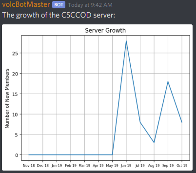
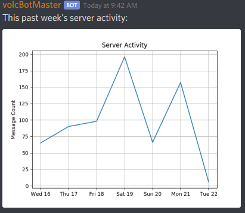

# volcBotMaster
## ~~Useless~~ discord bot with zero aspirations but infinite potential

### This project was started as a means to learn python and working with data etc.
### Expect jank and low efficiency all around :^)
### This Readme will be updated as I progress through the below Roadmap. Expect install instructions and reference documentation at an **_extremely_** slow pace, as I will have to rediscover my own efforts as I go back to document them.

Business inquiries/if you want to yell at me for butchering this language:
> email: jberesford@volcaus.com | discord: JBeresford#2604

## Screenshots
Server Growth, shown as new members per month:  
  
Server Activity, shown as # of messages sent per day:  
  
Top Chatters, shown as given users # of messages sent:  
  

## Prime Directives:

1. Obtain Knowledge - 0% completion

2. Keep all functionality modular on two levels - completion scales with project

   - Server-specific data for users

   - Modular source-code for development

3. Keep track of all user data for use in the following - ~75% completion

4. Permissions system - ~75% completion

5. Provide visualizations of user data/server statistics - ~90% completion

6. Server moderation functionality - ~idk% completion
    
    
## Secondary Objectives:

1. Maybe some fun stuff
    
   - !dice command
        
   - !quote(s)
    
2. Game??!

3. DDOS on @mention

4. Interact with online data/API's

    - League of Legends comes to mind

    - Cryptocurrency pricing

5. Order dominos delivery from #general (maybe store credit card info, unsure)

[-1]. (try to) Maintain poorly written code
    
## Tertiary Tasks:

1. Have fun

## Roadmap:

1. Prime Directives <-- you are here

2. Documentation

   - Reference docs

   - Install instructions

   - etcetera?

3. Secondary Objectives

4. Tertiary Tasks
