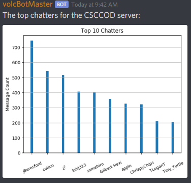

# volcBotMaster
## ~~Useless~~ discord bot with zero aspirations but infinite potential

Business inquiries:
> email: jberesford@volcaus.com | discord: JBeresford#2604

## Screenshots
Server Growth, shown as new members per month:  
  
Server Activity, shown as # of messages sent per day:  
  
Top Chatters, shown as given users # of messages sent:  
  

## Current Augmentations (Cogs/Modules)

1. Administrator Augments
   -  Ban users
2. Augmentation Augments
   -  Enable augmentations
   -  Disable augmentations
3. General Augments
   -  List administrators
   -  List moderators
4. Graphing Augments
   -  Role distribution
   -  Server activity
   -  Server growth
   -  Top 10 chatters
5. Images Augments
   -  Count images sent to server
   -  Describe a given image from the data base
   -  Retrieve an image from the data base
6. Moderator Augments
   -  Kick users
   -  Purge messages
   -  Restrict commands from non-moderator usage
7. Nonsense Augments
   -  Fun and games
   
## Augmentations To Do

*  Mathematics augments
*  Image recognition augments

## Roadmap:

1. Augmentations - ~80%

2. Documentation - ~ 15%

   - Reference docs

   - Install instructions
